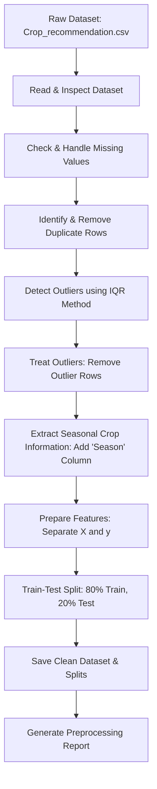

# OptiCrop - Data Preprocessing (Epic 3)

## Project Objective
The objective of this module is to prepare the **OptiCrop** (Smart Agricultural Production Optimization System) dataset for machine learning. This involves data cleaning, handling missing values, removing duplicates, detecting and treating outliers, feature engineering (seasonal crop information extraction), and dividing the dataset into training and testing sets.

---

## Preprocessing Workflow
The workflow for the preprocessing pipeline is structured as follows:



---

## Tasks Performed

1. **Libraries Imported**: Loaded `pandas`, `numpy`, `matplotlib`, `seaborn`, and `sklearn` for data manipulation, visualization, and splitting.
2. **Dataset Loading**: Loaded the `Crop_recommendation.csv` dataset and displayed metadata including `.head()`, shape, column list, and data types, with robust exception handling.
3. **Missing Values Analysis**: Inspected the dataset for missing values. Found no missing values in this dataset. Had they existed, a heatmap (`missing_values.png`) would have been saved, and missing values in numerical columns would have been imputed using the column median.
4. **Duplicate Record Checks**: Checked for duplicate records. Removed any duplicate rows if found.
5. **Outlier Detection and Treatment**:
   - Calculated Interquartile Range (IQR) for numerical features: `N`, `P`, `K`, `temperature`, `humidity`, `ph`, `rainfall`.
   - Identified outlier values falling outside $1.5 \times \text{IQR}$ bounds.
   - Removed rows containing outliers to prevent model distortion.
   - Saved a before-and-after boxplot comparison to `plots/outliers.png`.
6. **Feature Engineering (Season Extraction)**:
   - Added a new categorical feature `Season` using the following temperature-based logic:
     - $\text{Temperature} < 20^\circ\text{C} \rightarrow$ **Winter**
     - $20^\circ\text{C} \le \text{Temperature} \le 30^\circ\text{C} \rightarrow$ **Monsoon**
     - $\text{Temperature} > 30^\circ\text{C} \rightarrow$ **Summer**
7. **Train-Test Split**:
   - Separated features ($X$) and target ($y$, `label`).
   - Split the cleaned dataset into an 80% training set and a 20% testing set using `train_test_split` with `random_state=42` and stratification to preserve class distributions.
8. **Artifact Generation**: Exported all processed datasets, plots, and a summary report.

---

## Folder Structure

```text
04_Preprocessing/
│
├── README.md                  # This documentation file
├── preprocessing.py           # Main preprocessing script
│
├── outputs/
│   ├── cleaned_dataset.csv    # Fully cleaned dataset with the 'Season' feature
│   ├── train.csv              # Training set split (80%)
│   ├── test.csv               # 07_Testing set split (20%)
│   └── preprocessing_report.txt # Text summary of the preprocessing results
│
└── plots/
    ├── missing_values.png     # Heatmap of missing values (generated if missing values exist)
    └── outliers.png           # Before-and-after outlier boxplot comparison
```

---

## Outputs Generated

- **`outputs/cleaned_dataset.csv`**: Cleaned dataset (after duplicate and outlier removal) containing the engineered `Season` column.
- **`outputs/train.csv`**: Training subset of the cleaned dataset (1416 records).
- **`outputs/test.csv`**: 07_Testing subset of the cleaned dataset (354 records).
- **`outputs/preprocessing_report.txt`**: A comprehensive text report summarizing the pipeline run.
- **`plots/outliers.png`**: Visual comparison of features before and after IQR outlier treatment.

---

## How to Run

To run the preprocessing pipeline, execute the following command from the project root directory or the `04_Preprocessing` directory:

```bash
# Run from the project root
python 04_Preprocessing/preprocessing.py

# Or run from inside the 04_Preprocessing directory
cd 04_Preprocessing
python preprocessing.py
```

---

## Expected Results

Upon successful execution, the script will output step-by-step progress details to the console, showing dataset shapes, missing values tables, duplicate counts, outlier counts per feature, and split sizes. It will also generate all the files listed in the **Folder Structure** section.
