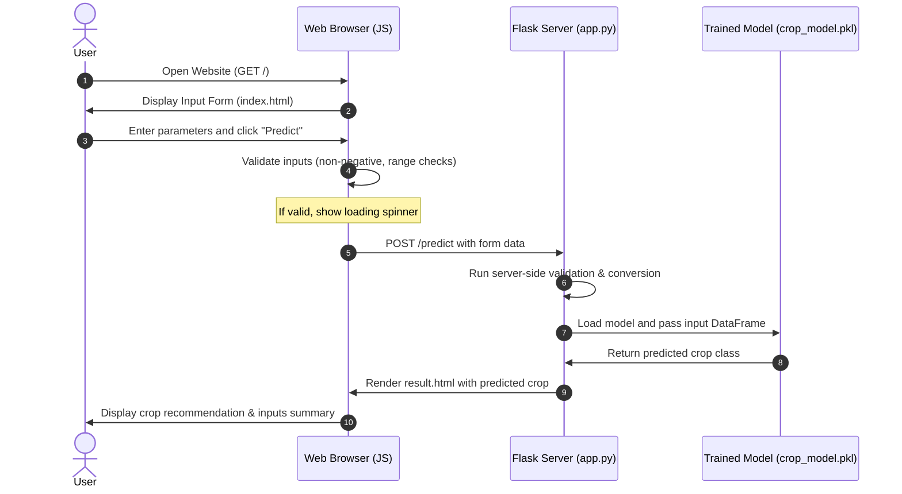

# OptiCrop - Web Application (Epic 5)

This directory contains the complete web application for **OptiCrop – Smart Agricultural Production Optimization System**. The application is built using **Flask** (Python) for the backend and a premium, responsive **Nature-Tech Glassmorphic** theme using HTML5, CSS3, and JavaScript for the frontend.

The application loads a pre-trained Machine Learning model (`crop_model.pkl`) and allows users to input soil and weather characteristics to receive a crop recommendation instantly.

---

## Technologies Used

* **Backend**: Flask (Python 3.x), Pandas, NumPy, Joblib, Scikit-learn
* **Frontend**: HTML5, CSS3 (Vanilla Custom styling with glassmorphism), JavaScript (ES6+ for validation and loader)
* **Model**: Pre-trained crop recommendation model (`crop_model.pkl`)

---

## Folder Structure

```text
06_Web_Application/
│
├── app.py                  # Main Flask application entry point
├── requirements.txt        # Python package dependencies
├── README.md               # This documentation file
│
├── model/
│   └── crop_model.pkl      # Pre-trained ML model bundle (joblib pickle)
│
├── templates/
│   ├── index.html          # Main landing page containing the input form
│   └── result.html         # Recommendation result display page
│
├── static/
│   ├── css/
│   │   └── style.css       # Custom premium glassmorphic stylesheet
│   ├── js/
│   │   └── script.js       # Client-side validation & loader interactions
│   └── images/             # Directory for web assets
│
└── screenshots/            # Saved screenshots of the application
```

---

## Application Workflow



---

## Installation Steps

Follow these steps to set up and run the application locally in VS Code:

### 1. Prerequisite
Ensure you have Python 3.8+ installed on your system.

### 2. Create a Virtual Environment (Optional but recommended)
Open your terminal inside the `Optic-Crop` directory and run:

```bash
# Create a virtual environment
python -m venv .venv

# Activate the virtual environment (Windows)
.venv\Scripts\activate

# Activate the virtual environment (macOS/Linux)
source .venv/bin/activate
```

### 3. Install Dependencies
Navigate to the `06_Web_Application` folder and install the required libraries:

```bash
cd 06_Web_Application
pip install -r requirements.txt
```

---

## How to Run

Start the Flask development server:

```bash
python app.py
```

By default, the application will run locally at:
👉 **[http://127.0.0.1:5000](http://127.0.0.1:5000)**

Open this URL in your web browser to use the application.

---

## Screenshots

*(Placeholder for adding screenshots after deployment)*
* **Home Page**: The landing page displaying the nature-tech glassmorphic card form.
* **Prediction Result**: The animated card displaying the recommended crop and confidence score.

---

## Future Scope

The application is built with a modular structure, allowing you to easily add the following features in the future:
1. **Fertilizer Recommendation**: Suggest appropriate fertilizers based on the N-P-K ratios entered.
2. **Crop Disease Detection**: Add an image upload section to diagnose crop diseases using computer vision.
3. **Yield Prediction**: Predict the expected tonnage of the crop based on farm size and rainfall.
4. **Weather Forecast API**: Auto-fill temperature, humidity, and rainfall using a weather API based on the user's location.
5. **Dashboard & Prediction History**: Allow registered users to save their predictions and visualize soil nutrient trends over time.
