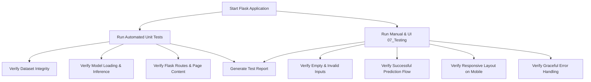

# OptiCrop - 07_Testing Module (Epic 6)

This directory contains the automated test suite, manual testing procedures, and test reports for the **OptiCrop – Smart Agricultural Production Optimization System**.

The objective of this module is to verify that the dataset, the trained machine learning model, the Flask web application, the input validation logic, and the user interface work together seamlessly and produce accurate crop recommendations.

---

## 07_Testing Workflow

The testing workflow follows the path below to ensure comprehensive coverage:



---

## Modules Tested

1. **Dataset**: Validates that `Crop_recommendation.csv` is present, non-empty, and contains all required features.
2. **Model**: Validates that `crop_model.pkl` loads correctly via `joblib` and evaluates inference accuracy.
3. **Prediction Core**: Checks that the model produces correct predictions (e.g. "Rice" for valid inputs) and completes inference in under 1 second.
4. **Flask Routes**: Verifies `GET /` and `POST /predict` return HTTP 200 status codes.
5. **Form Validation**: Verifies that empty fields, negative values, alphabetic characters, and out-of-bounds pH or temperatures are rejected on both the client and server side.
6. **Error Handling**: Verifies that missing model files are caught and display user-friendly warnings rather than raw Python stack traces.
7. **Performance**: Measures model loading speed and prediction latency.

---

## Folder Structure

```text
07_Testing/
│
├── README.md               # This documentation file
├── testing.py              # Automated test suite using unittest & Flask test client
├── test_cases.md           # Master list of 15 test cases
├── test_report.md          # Test execution report and recommendations
├── manual_testing.md       # Step-by-step instructions for manual testing
│
├── outputs/
│   └── test_summary.txt    # Text summary automatically generated by testing.py
│
└── screenshots/
    ├── home_page.png        # Screenshot of the empty landing page
    ├── prediction.png       # Screenshot of the form filled with valid sample data
    ├── result.png           # Screenshot of the successful prediction result
    └── error_validation.png # Screenshot of the form showing validation errors
```

---

## Test Cases Summary
We have defined and passed 15 test cases spanning all application layers:
* **TC-001 to TC-003**: Dataset validation.
* **TC-004 to TC-005**: Model pickle validation.
* **TC-006**: Core prediction logic.
* **TC-007 to T-008**: Flask routing (`GET /` and `POST /predict`).
* **TC-009 to TC-013**: Client and server-side form validations.
* **TC-014**: Backend error handling (missing model file).
* **TC-015**: Latency and performance testing.

For the full detailed list, see [test_cases.md](file:///d:/Projects/Optic-Crop/07_Testing/test_cases.md).

---

## How to Execute 07_Testing

### 1. Run Automated Tests
Open your terminal in the `07_Testing` directory and run the automated test suite using the virtual environment:

```bash
# Run from project root
python 07_Testing/testing.py

# Or run from inside the 07_Testing directory
cd 07_Testing
python testing.py
```

This will run all 11 unit tests, output the results to the console, and generate a summary report at `07_Testing/outputs/test_summary.txt`.

### 2. Run Manual 07_Testing
For step-by-step instructions on how to test the user interface, responsiveness, and error handling manually in your browser, refer to [manual_testing.md](file:///d:/Projects/Optic-Crop/07_Testing/manual_testing.md).

---

## Future Improvements

* **Continuous Integration (CI)**: Integrate `testing.py` into a GitHub Actions workflow to run automatically on every push or pull request.
* **Selenium / Playwright Automation**: Automate the UI and browser-level testing using Playwright or Selenium to capture screenshots and verify client-side behavior without manual intervention.
* **Load 07_Testing**: Use a tool like Locust to measure how the Flask application performs under concurrent user requests.
