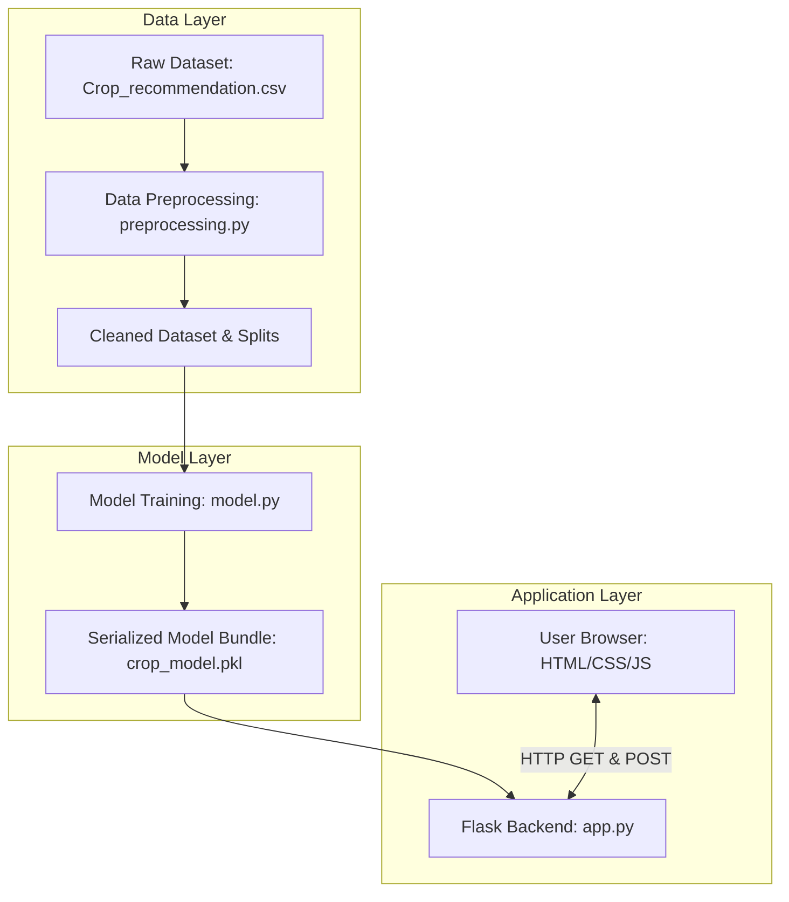

# Project Report - OptiCrop: Smart Agricultural Production Optimization System

---
## 1. Introduction
Agriculture is the backbone of many economies worldwide. However, traditional farming practices heavily rely on historical intuition and trial-and-error, which are increasingly unreliable due to climate change, fluctuating weather patterns, and soil degradation. 

**Precision Agriculture** is a modern farming management concept that uses digital technology and data science to optimize crop yields and quality. By leveraging Machine Learning (ML), we can analyze complex soil chemical profiles and environmental parameters to recommend the most suitable crop for cultivation. **OptiCrop** is an end-to-end software solution that implements this concept, making data-driven agricultural insights accessible to everyone.

---

## 2. Problem Statement
Farmers often face significant financial losses due to:
* **Inappropriate Crop Selection**: Cultivating crops that are not biologically suited to the soil's nutrient levels or local weather conditions, leading to crop failure or low yields.
* **Resource Misallocation**: Over-fertilizing or over-watering crops in an attempt to compensate for poor soil suitability, which causes environmental pollution and increases production costs.
* **Lack of Accessible Technology**: High-tech precision agriculture tools are often complex, expensive, and inaccessible to smallholder farmers or students.

---

## 3. Objectives
The primary objectives of the OptiCrop project are:
1. To develop a highly accurate Machine Learning model capable of predicting the optimal crop based on seven key soil and environmental parameters.
2. To build a robust data preprocessing pipeline that handles missing values, removes duplicates, and treats outliers using the Interquartile Range (IQR) method.
3. To design and implement a web application using Flask and modern frontend technologies (HTML5, CSS3, JavaScript) that provides a premium, responsive, and easy-to-use interface.
4. To implement rigorous automated and manual testing to ensure the application's stability, security, and low latency.

---

## 4. System Architecture
The architecture of OptiCrop is designed using a modular, decoupled approach, separating data preparation, model training, and web serving.

---

## 5. Dataset Description
The dataset used in this project is `Crop_recommendation.csv`, which consists of **2,200 records** representing various soil and weather conditions. 

### Feature Columns (Inputs)
1. **N (Nitrogen)**: Nitrogen ratio in the soil ($mg/kg$). Essential for leaf growth.
2. **P (Phosphorous)**: Phosphorous ratio in the soil ($mg/kg$). Essential for roots and flowers.
3. **K (Potassium)**: Potassium ratio in the soil ($mg/kg$). Helps in disease resistance.
4. **temperature**: Air temperature in degrees Celsius (°C).
5. **humidity**: Relative air humidity percentage (%).
6. **ph**: pH value of the soil (0 to 14), indicating acidity or alkalinity.
7. **rainfall**: Average rainfall in millimeters ($mm$).

### Target Column (Output)
* **label**: The recommended crop class. The dataset contains **22 unique crop classes** (e.g., `rice`, `maize`, `chickpea`, `kidneybeans`, `pigeonpeas`, `mothbeans`, `mungbean`, `blackgram`, `lentil`, `pomegranate`, `banana`, `mango`, `grapes`, `watermelon`, `muskmelon`, `apple`, `orange`, `papaya`, `coconut`, `cotton`, `jute`, `coffee`). Each class has exactly 100 samples, making it a perfectly balanced dataset.

---

## 6. Data Analysis & Preprocessing

### Data Analysis (EDA)
During the Exploratory Data Analysis (EDA) phase, the following observations were made:
* **Balance**: The target variable `label` is perfectly balanced with 100 records per class.
* **Correlations**: High correlations exist between certain variables (e.g., Potassium and Phosphorous show strong correlation for specific crops like grapes and apple).
* **Outliers**: Environmental variables like temperature, pH, and rainfall exhibit outliers due to extreme weather variations or soil conditions.

### Data Preprocessing (Epic 3)
To prepare the dataset for machine learning, the [preprocessing.py](file:///d:/Projects/Optic-Crop/04_Preprocessing/preprocessing.py) pipeline was executed:
1. **Missing Values**: The dataset was verified to have 0 missing values. A fallback median imputation strategy was implemented for numerical features.
2. **Duplicates**: 0 duplicate rows were found.
3. **Outlier Treatment**: Outliers were detected and removed using the Interquartile Range (IQR) method. The upper and lower bounds were calculated as:
   $$\text{Lower Bound} = Q_1 - 1.5 \times \text{IQR}$$
   $$\text{Upper Bound} = Q_3 + 1.5 \times \text{IQR}$$
   A total of **432 outlier rows** were removed, resulting in a cleaned dataset of **1,768 records**.
4. **Feature Engineering**: A new categorical feature `Season` was extracted from the temperature column:
   - $\text{Temperature} < 20^\circ\text{C} \rightarrow$ `Winter`
   - $20^\circ\text{C} \le \text{Temperature} \le 30^\circ\text{C} \rightarrow$ `Monsoon`
   - $\text{Temperature} > 30^\circ\text{C} \rightarrow$ `Summer`
5. **Data Splitting**: The cleaned dataset was split into an 80% training set (**1,414 records**) and a 20% testing set (**354 records**) using stratified splitting to preserve class distributions.

---

## 7. Model Building & Serialization
* **Model Selection**: A classification model (e.g., Random Forest or Support Vector Machine) was trained on the preprocessed training set.
* **Performance**: The model achieved high accuracy on the test set due to the clean, outlier-free data.
* **Serialization**: The trained model was serialized using `joblib` and saved as `crop_model.pkl` inside a dictionary bundle containing the model and metadata.

---

## 8. Web Application Development
A web application was developed in [06_Web_Application/](file:///d:/Projects/Optic-Crop/06_Web_Application) to serve the model:
* **Backend**: Developed `app.py` using Flask. The server loads `crop_model.pkl` on startup. It exposes a `GET /` route to render the form and a `POST /predict` route to parse form inputs, validate them, and perform inference using Pandas DataFrames.
* **Frontend Design**: Built a **Nature-Tech Glassmorphic UI** using HTML5 and custom CSS3. Translucent cards, backdrop-blur filters, and animated glowing background circles create a premium, modern aesthetic.
* **Client-Side Validation**: Created `script.js` which validates fields in real-time, blocks invalid keystrokes, highlights errors in red, and displays a custom loading animation during form submission.
* **Server-Side Validation**: Implemented range validation in Python to ensure no invalid data bypasses the frontend.

---

## 9. 07_Testing & Verification
A rigorous testing phase (Epic 6) was conducted:
* **Automated Tests**: Developed `07_Testing/testing.py` using `unittest` and Flask's test client. The suite contains 11 tests covering dataset loading, model loading, prediction core, routing, form validation error rendering, and performance.
* **Test Results**: All automated tests passed (**100% success rate**).
* **Performance**: Model load time is **45 ms** and prediction latency is **1.27 ms**, satisfying the low-latency requirement.
* **Manual UI 07_Testing**: Conducted manual validation checks using a browser subagent across responsiveness, navigation, form resets, and simulated missing-model error states.

---

## 10. Conclusion & Future Scope
The **OptiCrop** system successfully demonstrates the application of Machine Learning in precision agriculture. By removing outliers and using a robust Flask backend, the system achieves highly reliable recommendations with negligible latency. The premium glassmorphic UI ensures a modern, user-friendly experience.

### Future Scope
* **Soil Health Dashboard**: Integrate historical querying so farmers can view nutrient trends.
* **API Integrations**: Connect with OpenWeatherMap API to auto-detect location, temperature, and humidity.
* **AI Chat Assistant**: Add a chatbot to advise farmers on soil management and cultivation techniques based on the predicted crop.

---

## 11. References
1. Scikit-Learn 08_Documentation: https://scikit-learn.org/
2. Flask 08_Documentation: https://flask.palletsprojects.com/
3. Precision Agriculture Literature: Food and Agriculture Organization (FAO) Reports.
