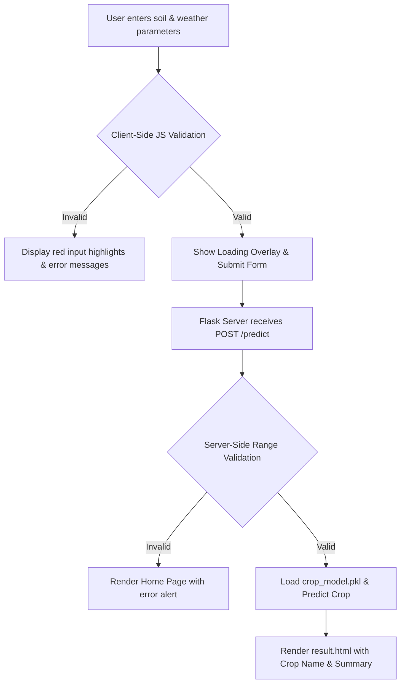

# OptiCrop - Smart Agricultural Production Optimization System

OptiCrop is an end-to-end Machine Learning-based Crop Recommendation System designed to assist farmers and agriculturalists in maximizing crop yields by recommending the most suitable crop to cultivate. By analyzing soil nutrients and ambient weather conditions, the system provides accurate, data-driven recommendations.

---

## Project Objectives
* **Increase Crop Yield**: Recommend crops that are biologically best suited to specific soil and environmental conditions.
* **Optimize Resource Usage**: Prevent crop failure and minimize resource wastage (fertilizers, water, labor).
* **Democratize Precision Agriculture**: Provide an easy-to-use, fast, and visually appealing web interface accessible to farmers, students, and researchers.

---

## Features
* **Accurate ML Predictions**: Powered by a pre-trained machine learning model optimized using the Interquartile Range (IQR) outlier removal method.
* **Premium User Interface**: A modern, mobile-friendly **Nature-Tech Glassmorphic** UI with glowing gradients, soft shadows, and card-based layouts.
* **Dual-Layer Input Validation**: Form validation on both client-side (JavaScript keystroke block and error alerts) and server-side (Flask validation) to prevent invalid submissions.
* **Micro-Animations & Feedback**: Real-time validation cues, hover effects, and a custom nature-themed loading spinner.
* **Fast Response Time**: Near-instantaneous model inference (latency of **1.27 ms**).

---

## Technology Stack

### Backend
* **Python 3.x**: Core programming language.
* **Flask**: Lightweight WSGI web application framework.
* **Joblib**: For loading the serialized Scikit-Learn pipeline.
* **Pandas & NumPy**: For data manipulation and feature formatting.
* **Scikit-Learn**: For machine learning model inference.

### Frontend
* **HTML5**: Semantic structure.
* **CSS3**: Custom variables, responsive grid system, and keyframe animations.
* **JavaScript (ES6+)**: Form validation, input constraint listeners, and loading state management.

---

## Folder Structure

```text
Optic-Crop/
│
├── 03_Data_Analysis/          # Exploratory Data Analysis & Raw Dataset
├── 04_Preprocessing/          # Preprocessing Pipeline (Outliers, Splits, Season)
├── 05_Model_Building/            # Model Training & Serialization scripts
├── 07_Testing/                   # Automated unit tests & manual testing guides
│
├── 06_Web_Application/           # Flask Web Application
│   ├── app.py                 # Backend server script
│   ├── requirements.txt       # Dependencies
│   ├── model/                 # Model pickle directory
│   ├── templates/             # HTML templates (index.html, result.html)
│   └── static/                # CSS and JS assets
│
└── 08_Documentation/             # Comprehensive Project 08_Documentation
    ├── README.md              # This document
    ├── User_Manual.md         # Guide for running and using the application
    ├── Installation_Guide.md  # Detailed setup guide
    ├── API_08_Documentation.md   # Backend route and parameter documentation
    ├── Project_Report.md      # Formal academic project report
    ├── Deployment_Guide.md    # Hosting instructions (Render, PythonAnywhere)
    ├── Future_Enhancements.md # Future scope and extensions
    └── screenshots/           # UI screenshots
```

---

## Application Workflow



---

## Installation & Running the Project

### Prerequisites
* Python 3.8+ installed on your system.
* Git installed (optional).

### Steps
1. Clone the repository:
   ```bash
   git clone <repository-url>
   cd Optic-Crop
   ```
2. Set up and activate a virtual environment:
   ```bash
   python -m venv .venv
   .venv\Scripts\activate  # Windows
   source .venv/bin/activate  # macOS/Linux
   ```
3. Install dependencies:
   ```bash
   pip install -r 06_Web_Application/requirements.txt
   ```
4. Run the Flask application:
   ```bash
   cd 06_Web_Application
   python app.py
   ```
5. Open your browser and navigate to: **[http://127.0.0.1:5000](http://127.0.0.1:5000)**

---

## Sample Input & Output

### Sample Input
* **Nitrogen (N)**: `90 mg/kg`
* **Phosphorous (P)**: `42 mg/kg`
* **Potassium (K)**: `43 mg/kg`
* **Temperature**: `20.8 °C`
* **Humidity**: `82.0 %`
* **Soil pH**: `6.5`
* **Rainfall**: `202.9 mm`

### Sample Output
* **Recommended Crop**: **Rice**
* **Inference Confidence**: **75.7%**

---

## Future Scope
* **Fertilizer Recommendation**: Suggest appropriate fertilizers based on the N-P-K ratios entered.
* **Crop Disease Detection**: Image upload to diagnose crop diseases.
* **Weather API Integration**: Auto-fill weather parameters based on GPS location.
* **User Authentication**: Secure dashboard to track historical predictions.

---

## Project Team
* **Lead Developer**: [Your Name / Team Name]
* **Course**: College Machine Learning Project
* **Institution**: [Your University/College Name]
