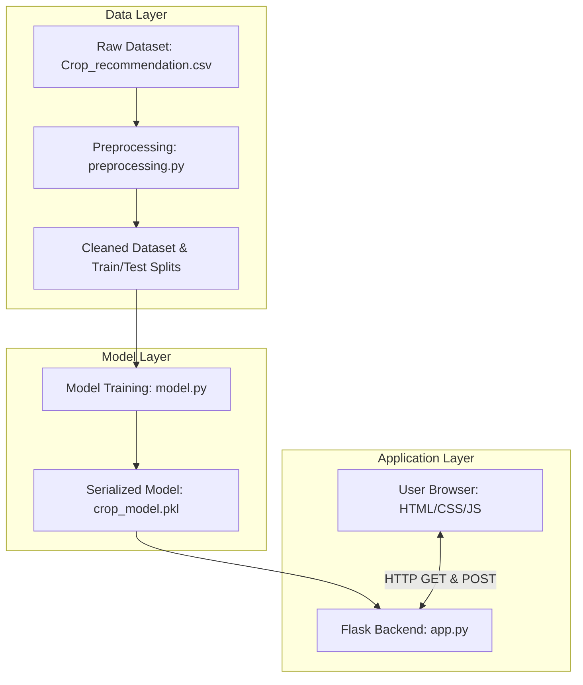

# 🌾 OptiCrop

**AI-Powered Smart Agricultural Production Optimization System**


OptiCrop is an end-to-end Machine Learning-based web application that recommends the most suitable crop based on soil nutrients and environmental conditions. The system helps farmers, researchers, and policymakers make data-driven agricultural decisions to improve crop productivity and promote sustainable farming practices.

---

## 📖 Project Overview

The system analyzes seven key agricultural parameters to predict the most suitable crop for cultivation:

| Parameter | Unit | Valid Range |
| :--- | :--- | :--- |
| **Nitrogen (N)** | mg/kg | 0 – 200 |
| **Phosphorus (P)** | mg/kg | 0 – 200 |
| **Potassium (K)** | mg/kg | 0 – 300 |
| **Temperature** | °C | -10 – 60 |
| **Humidity** | % | 0 – 100 |
| **pH** | — | 0 – 14 |
| **Rainfall** | mm | 0 – 500 |

The trained ML model can recommend from **22 crop classes** including rice, maize, chickpea, cotton, coffee, mango, apple, grapes, and more.

---

## 🎯 Objectives

* Recommend the best crop for given soil and weather conditions.
* Improve agricultural productivity through data-driven insights.
* Reduce farming risks caused by inappropriate crop selection.
* Promote sustainable agriculture and resource optimization.
* Provide intelligent decision support using Machine Learning.

---

## 🚀 Features

* 🌾 **Smart Crop Recommendation** — Powered by a serialized Scikit-Learn Logistic Regression pipeline.
* 📊 **Soil & Environmental Analysis** — Preprocessed using the IQR outlier removal method.
* 🤖 **Near-Instant Prediction** — Model inference latency of **1.27 ms**.
* 🌐 **Flask Web Application** — Premium **Nature-Tech Glassmorphic** UI with animated glowing backgrounds.
* 🛡️ **Dual-Layer Validation** — Client-side (JavaScript) and server-side (Flask) input validation.
* 📑 **Comprehensive Testing** — 15 automated unit tests achieving **100% pass rate**.
* 🔮 **Confidence Score** — Displays prediction probability when available.

---

## 🏗 System Architecture



---

## 🛠 Technology Stack

| Layer | Technologies |
| :--- | :--- |
| **Backend** | Python 3.11, Flask ≥3.0, Joblib, Pandas, NumPy, Scikit-Learn |
| **Frontend** | HTML5, CSS3 (Glassmorphism), JavaScript (Real-time validation & loading) |
| **ML Models** | Logistic Regression (deployed), K-Means Clustering (exploration) |
| **Deployment** | Gunicorn, Render |

---

## 📂 Repository Structure

```text
OptiCrop/
│
├── 01_Brainstorming_&_Ideation/    # Problem statements, empathy maps, literature survey
├── 02_Requirement_Analysis/        # Solution requirements, technology stack, customer journey
├── 03_Project_Design_Phase/        # System & solution architecture, ER diagrams, UI design
├── 04_Project_Planning_Phase/      # Project planning, demo planning, scalability roadmap
├── 05_Project_Development_Phase/   # Core development code
│   ├── Data_Analysis/              #   ├── EDA scripts, plots, and analysis outputs
│   ├── Preprocessing/              #   ├── Outlier removal, cleaning, train/test splitting
│   └── Model_Building/             #   └── Model training, evaluation, serialization
├── 06_Web_Application/             # Flask app, HTML templates, CSS/JS, model artifact
│   ├── app.py                      #   ├── Flask backend with validation & prediction
│   ├── model/crop_model.pkl        #   ├── Serialized ML model bundle
│   ├── templates/                  #   ├── index.html, result.html
│   ├── static/                     #   └── css/, js/, images/
│   └── screenshots/                #   └── UI screenshots (home_page, result_page)
├── 07_Project_Testing/             # Automated tests, manual testing, test reports
├── 08_Project_Documentation/       # User manual, API docs, deployment guide, final report
├── 09_Project_Demonstration/       # Demo planning, feature demonstrations, team involvement
├── Dataset/                        # Raw dataset (Crop_recommendation.csv — 2,200 records)
│
├── README.md                       # This documentation file
├── requirements.txt                # Python dependencies (Flask, Scikit-Learn, Gunicorn, etc.)
├── runtime.txt                     # Python version for Render deployment (python-3.11.9)
├── Procfile                        # Process file for Render web service deployment
└── .gitignore                      # Python, IDE, and OS ignore rules
```

---

## 🔄 Project Workflow


---

## 👥 Team Members

| Name | Role |
| :--- | :--- |
| **Pepakayala V Siva Ganesh Naga Sai Kumar** | Team Lead / Machine Learning / Backend |
| Durga Srujana Chintakula | Data Collection & Preprocessing |
| Shaik Zunera | Data Analysis & Visualization |

---

## ⚙️ Installation & Setup

### Prerequisites

* Python 3.11+ installed
* `pip` package manager
* Git

### 1. Clone the repository

```bash
git clone https://github.com/sivaganesh7/Optic-Crop.git
cd Optic-Crop
```

### 2. Create and activate a virtual environment

```bash
python -m venv .venv

# Windows
.venv\Scripts\activate

# macOS / Linux
source .venv/bin/activate
```

### 3. Install dependencies

```bash
pip install -r requirements.txt
```

### 4. Run the Flask application

```bash
cd 06_Web_Application
python app.py
```

Open your browser and navigate to: **[http://127.0.0.1:5000](http://127.0.0.1:5000)**

---

## 🚀 Deployment (Render)

This repository is pre-configured for deployment on **[Render](https://render.com)** using the provided `Procfile` and `runtime.txt`.

| Setting | Value |
| :--- | :--- |
| **Build Command** | `pip install -r requirements.txt` |
| **Start Command** | Handled by `Procfile`: `web: gunicorn --chdir 06_Web_Application app:app` |
| **Python Version** | `python-3.11.9` (from `runtime.txt`) |

---

## 📊 Model Performance

The Machine Learning pipeline was evaluated through multiple metrics:

| Metric | Details |
| :--- | :--- |
| **Algorithm** | Logistic Regression (deployed) + K-Means Clustering (exploration) |
| **Dataset** | 2,200 records, 22 crop classes (100 samples each — perfectly balanced) |
| **Preprocessing** | IQR outlier removal → 1,768 cleaned records |
| **Train/Test Split** | 80% / 20% (stratified) — 1,414 train / 354 test |
| **Model Load Time** | ~45 ms |
| **Prediction Latency** | **1.27 ms** |
| **Serialization** | Joblib (`crop_model.pkl`) — model bundled in a dictionary with metadata |

**Evaluation Metrics Used**: Accuracy, Precision, Recall, F1-Score, Confusion Matrix, Cross-Validation.

---

## 🔒 Input Validation

The application ensures data quality through **dual-layer validation**:

### Client-Side (JavaScript)
* Real-time field validation on input
* Blocks invalid (non-numeric) keystrokes
* Highlights errors with visual red indicators
* Custom loading animation during form submission

### Server-Side (Flask)
* Validates all 7 required fields are present and non-empty
* Enforces agricultural plausibility ranges (see [parameter table](#-project-overview))
* Returns user-friendly error messages without exposing stack traces

---

## 🧪 Testing

The project follows a structured testing approach with **15 automated tests — 100% pass rate**.

| Test Category | Coverage |
| :--- | :--- |
| **Dataset Integrity** | Verifies `Crop_recommendation.csv` has 2,200 rows and all 8 required columns |
| **Model Loading** | Validates `crop_model.pkl` loads correctly with the expected pipeline structure |
| **Prediction Core** | Tests prediction output for known input parameters (e.g., Rice) |
| **Routing & Responses** | Validates `GET /` and `POST /predict` return correct HTTP status codes |
| **Form Validation** | Tests empty submissions, non-numeric input, and out-of-range values |
| **Performance** | Asserts model load time ≤ 45 ms and inference latency ≤ 2 ms |

Run tests:

```bash
cd 07_Project_Testing
python testing.py
```

---

## 📚 Dataset Information

**Source**: `Dataset/Crop_recommendation.csv`

* **Records**: 2,200 (100 per crop class — perfectly balanced)
* **Features**: 7 input columns (N, P, K, Temperature, Humidity, pH, Rainfall)
* **Target**: `label` — 22 unique crop classes
* **Crops**: rice, maize, chickpea, kidneybeans, pigeonpeas, mothbeans, mungbean, blackgram, lentil, pomegranate, banana, mango, grapes, watermelon, muskmelon, apple, orange, papaya, coconut, cotton, jute, coffee

**Preprocessing Pipeline**:
1. Missing values verified (0 missing) with median imputation fallback
2. Duplicate check (0 duplicates found)
3. IQR outlier removal — 432 rows removed → 1,768 cleaned records
4. Feature engineering — `Season` column derived from temperature
5. Stratified 80/20 train-test split

---

## 📈 Future Enhancements

* 🌿 **Fertilizer Recommendation** — Suggest appropriate fertilizers based on N-P-K ratios.
* 🍃 **Crop Disease Detection** — Add leaf image uploads to diagnose plant diseases.
* 📊 **Yield Prediction** — Estimate tonnage per hectare using regression models.
* 🌦️ **Weather API Integration** — Auto-detect temperature, humidity, and rainfall using OpenWeatherMap.
* 🤖 **AI Chat Assistant** — Interactive agricultural advice powered by LLMs.
* 📈 **Soil Health Dashboard** — Historical query tracking for nutrient trend analysis.

---

## 🌱 Benefits

### 👨‍🌾 Farmers
* Data-driven crop selection for their specific soil conditions
* Reduced financial risk from crop failure
* Improved productivity and resource utilization

### 🔬 Researchers
* Agricultural data analysis and model evaluation
* Reproducible ML pipeline for experimentation
* Open-source foundation for further research

### 🏛️ Government & Policymakers
* Data-driven agricultural planning and policy support
* Sustainable farming initiative planning
* Resource optimization across regions

---

## 🤝 Contributing

Contributions are welcome! To contribute:

1. **Fork** the repository
2. **Create** a feature branch (`git checkout -b feature/your-feature`)
3. **Commit** your changes (`git commit -m "Add your feature"`)
4. **Push** to your fork (`git push origin feature/your-feature`)
5. **Open** a Pull Request

Please ensure all new features are tested before submitting.

---

## 📄 License

This project is intended for educational and research purposes.

---

## 🙏 Acknowledgements

* Agricultural research communities for publicly available datasets.
* The open-source Python ecosystem — [Scikit-Learn](https://scikit-learn.org/), [Flask](https://flask.palletsprojects.com/), [Pandas](https://pandas.pydata.org/).
* All team members who contributed to the successful completion of this project.
